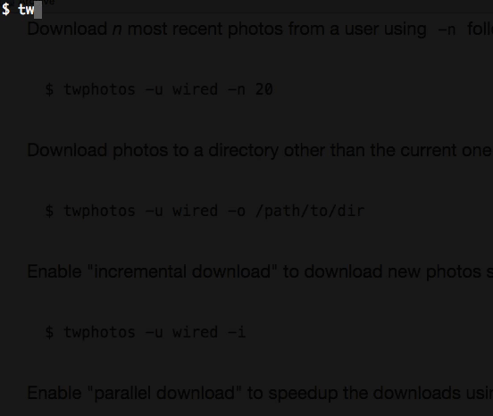

Twitter Photos
==============

.. image:: https://img.shields.io/pypi/v/twitter-photos.png
        :target: https://pypi.python.org/pypi/twitter-photos

.. image:: https://travis-ci.org/shichao-an/twitter-photos.png?branch=master
   :target: https://travis-ci.org/shichao-an/twitter-photos

Twitter Photos is a command-line tool to get photos from Twitter accounts.

Requirements
------------

* python-twitter
* requests
* urllib3

Installation
------------

You can install the package with pip::

  $ pip install twitter-photos

Or, you can download a source distribution and install with these commands::

  $ python setup.py install

How It Works
------------

The command-line front-end of Twitter Photos, "twphotos", downloads photos from specified Twitter accounts into individual directories each named after username. It hits the Twitter API as little as possible to retrieve photos links and download each link separately. You can view the links yourself and pipe them to other programs such as ``wget``. You can specifiy photo size, number of photos to get, and whether to download only new photos since last downloads.

Setup
-----

Create a config file at ~/.twphotos specifying your Twitter credentials (you can create an app and get your keys at `Twitter Application Management <https://apps.twitter.com/>`_)::

    [credentials]
    consumer_key = your_consumer_key
    consumer_secret = your_consumer_secret
    access_token_key = your_access_token_key
    access_token_secret = your_access_token_secret

Note that the values on the right side of ``=`` should not contain the quotes; they are just themselves since this file is in INI format.

Usage
-----
The simplest usage is to run "twphotos" from command-line without any options. This will download all photos from the current authenticated user (you)::

    $ twphotos

Download all photos from an existing user other than yourself with ``-u`` option followed by username. "twphotos" will automatically create a directory with the specified username and put downloaded photos in there::

    $ twphotos -u wired

Download *n* most recent photos from a user using ``-n`` followed by number::

    $ twphotos -u wired -n 20

Download photos to a directory other than the current one::

    $ twphotos -u wired -o /path/to/dir

Enable "incremental download" to download new photos since the last downloads with ``-i``::

    $ twphotos -u wired -i

Enable "parallel download" to speedup the downloads using the ``-r`` switch::

    $ twphotos -u wired -r

Print username, tweet ids, and URLs instead of downloading them with ``-p`` switch::

    $ twphotos -u wired -p

Exclude replies tweets using ``-e`` switch::

    $ twphotos -u wired -e

Download small-sized photos ::

    $ twphotos -u wired -s small

You can retrieve URLs only with ``cut`` command::

    $ twphotos -u wired -p | cut -d ' ' -f3

Command-line Options
~~~~~~~~~~~~~~~~~~~~
The "twphotos" command accepts the following options:

  -u USER, --user USER  user account
  -l LIST_SLUG, --list LIST_SLUG
                        list slug with --user as list owner
  -o OUTDIR, --outdir OUTDIR
                        output directory
  -p, --print           print media urls and tweet ids instead of download
  -r, --parallel        enable parallel download
  -n NUM, --num NUM     number of most recent photos to download
  -i, --increment       download only new photos since last download
  -e, --exclude_replies
                        exclude replies
  -s SIZE, --size SIZE  photo size (``large``, ``medium``, ``small`` and ``thumb``)
  -t TYPE, --type TYPE  timeline type (``user`` and ``favorites``)
